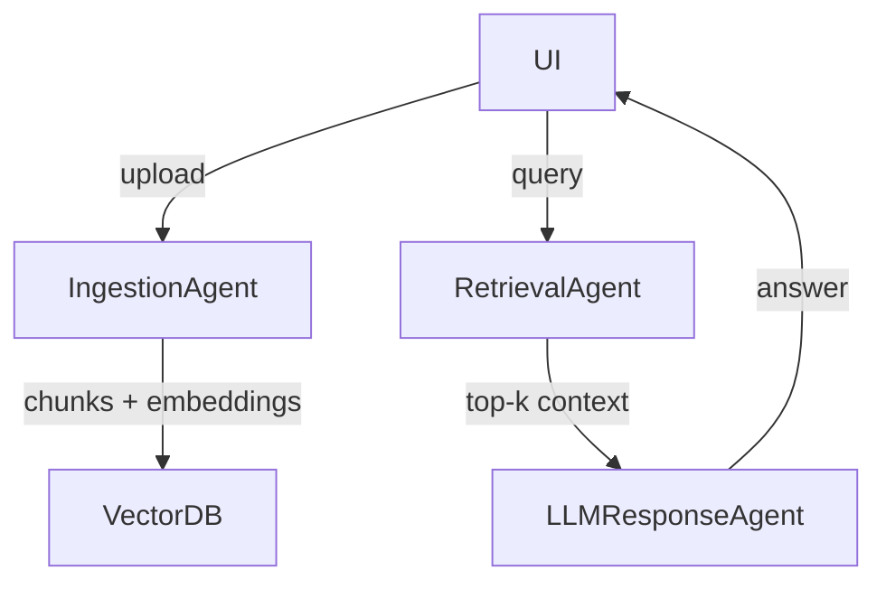
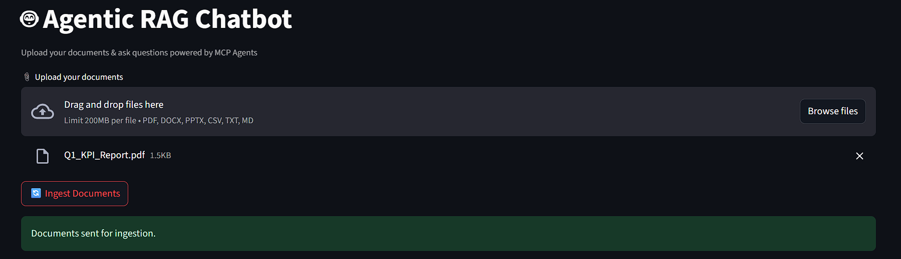
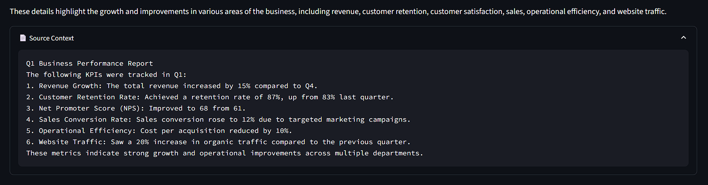

# 🤖 Agentic RAG Chatbot (Multi-Format Document QA)

A fully agent-based Retrieval-Augmented Generation (RAG) chatbot powered by **Groq LLMs**, capable of answering questions from uploaded **PDF, DOCX, PPTX, CSV, TXT, and Markdown** files.

It follows a modular, scalable **Model Context Protocol (MCP)** architecture with agents communicating through structured messages. Built using Python, FAISS, SentenceTransformers, Streamlit, and Groq API.

---

## 🚀 Features

- 📎 Upload multiple document formats
- 🧠 Agent-based architecture with 3 core agents
- 🔄 Custom MCP message-passing between agents
- 💬 Ask multi-turn questions
- 📚 Answers with source context
- ⚡ Groq LLM integration (LLaMA-3, Mixtral, etc.)
- 🖥️ Streamlit UI

---

## 🧠 Agent Architecture

All agents communicate via messages like:
{
  "sender": "RetrievalAgent",
  "receiver": "LLMResponseAgent",
  "type": "CONTEXT_RESPONSE",
  "trace_id": "abc-123",
  "payload": {
    "query": "What are the KPIs?",
    "top_chunks": ["slide 3: revenue +15%", "doc: Q1 summary..."]
  }
}

Tech Stack:

Frontend        : Streamlit
Backend Agents  : Python
Vector DB       : FAISS
Embeddings      : SentenceTransformers (all-MiniLM-L6-v2)
LLM             : Groq API (llama3-8b-8192, mixtral, etc.)
Messaging       : Custom in-memory MessageBus using MCP
File Parsing    : PyMuPDF, python-docx, python-pptx, pandas, markdown

## 📸 UI Screenshots

### 🔼 Upload Files

### 💬 Chat Interface

### 📄 Source Context

